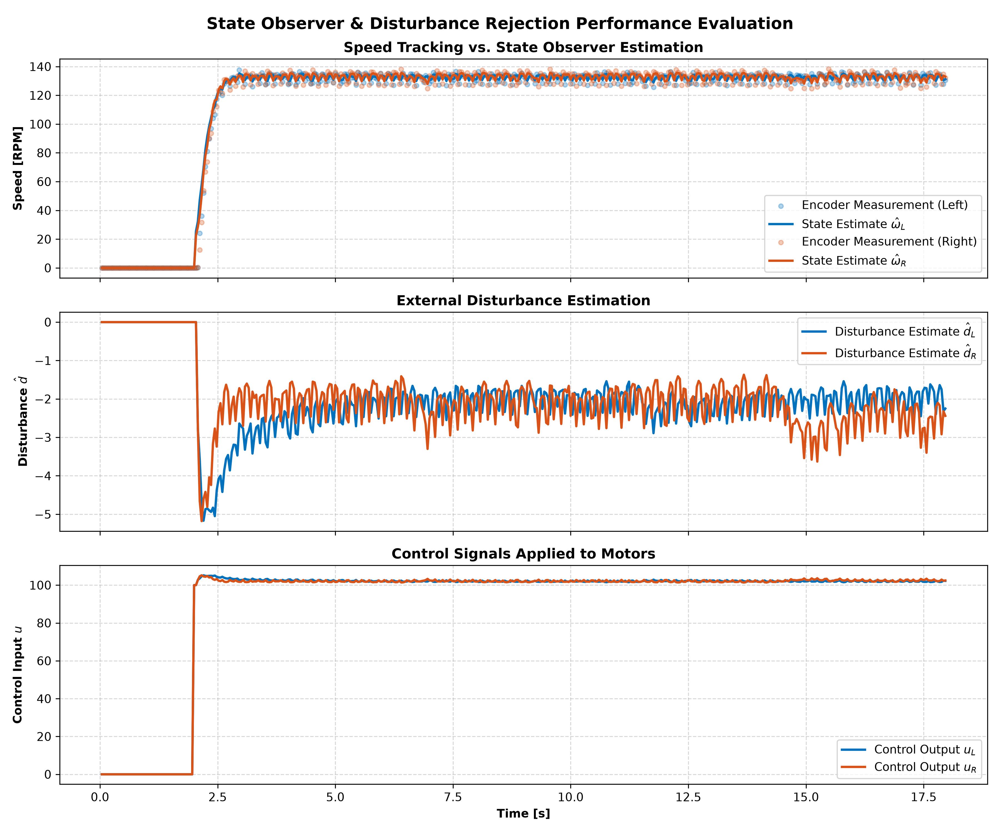
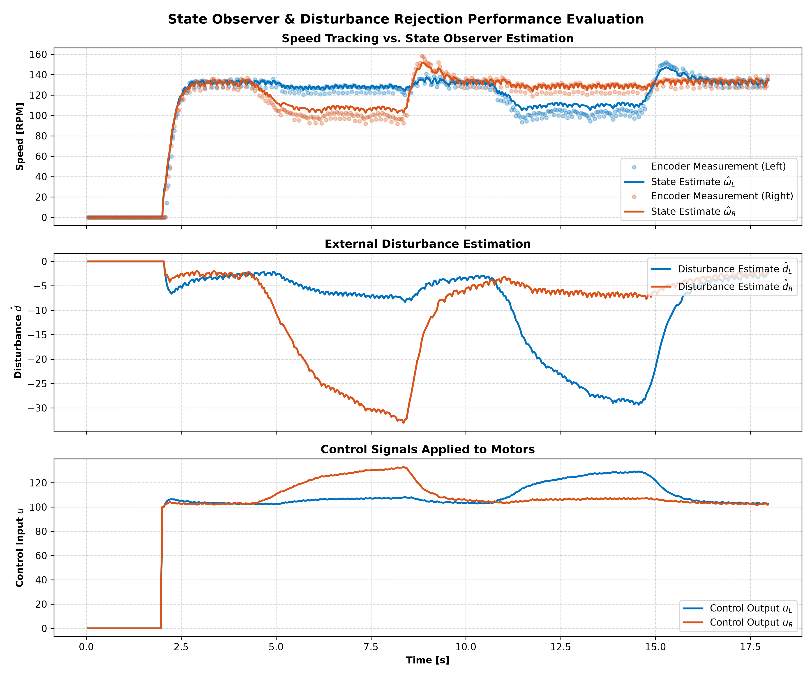

# Project 09: Real-Time Discrete State-Space Disturbance Observer

This repository presents the design, implementation, and experimental validation of a real-time discrete state-space disturbance observer for DC motor speed estimation.

Building upon the first-order motor models identified in **Project 08**, this project augments the system state to estimate unknown external disturbances acting on each motor. The observer executes in real time on an Arduino UNO, simultaneously estimating motor speed and equivalent input disturbances while compensating them through feedforward control.

---

# Project Overview

Although the state-space models identified in Project 08 accurately represent the nominal motor dynamics, real robotic systems are continuously affected by unknown disturbances that are not included in the mathematical model.

These disturbances may originate from:

- External loads applied to the wheels
- Mechanical friction variations
- Surface irregularities
- Battery voltage fluctuations
- Simplifications introduced during the identification process

Because these effects cannot be directly measured, they appear as modelling errors that degrade controller performance.

The objective of this project is therefore to design a **Luenberger Disturbance Observer** capable of estimating both the motor speed and the equivalent unknown disturbance acting on the system.

Unlike Project 08, where only the motor state was modeled, this observer augments the system dynamics with an additional disturbance state. The estimated disturbance is then compensated in real time through feedforward control, allowing the motor to automatically counteract unknown loads.

The observer operates synchronously with the physical motors at a sampling period of

$$
T_s = 40\text{ ms}
$$

using the discrete motor models identified experimentally in Project 08.

---

# State Observer Motivation

In practice, sensors provide only noisy measurements of the physical output.

For the DC motors considered in this project, wheel speed is measured using low-resolution optical encoders. Although encoder measurements represent the real system output, they contain:

- Quantization effects
- Electrical noise
- Mechanical vibration
- Measurement uncertainty

Using raw encoder data directly for control can therefore reduce performance.

A state observer reconstructs the internal system state by combining:

- the mathematical model;
- the measured encoder output;
- the applied control input.

Rather than relying entirely on noisy measurements, the observer continuously predicts the expected motor behaviour and corrects its estimates whenever new encoder measurements become available.

---

# Disturbance Modeling

The motor model identified in Project 08 is

$$
x[k+1]=A_dx[k]+B_du[k]
$$

where

- $x[k]$ represents motor speed
- $u[k]$ represents the applied PWM command.

This model assumes perfect knowledge of the system.

The state space model identified in Project 08 assumes that the motor always behaves according to the identified dynamics. In practice, however, this assumption is not always valid. Variations in battery voltage, mechanical friction, surface irregularities and other unmodelled effects cause the real motor to behave as if an additional unknown PWM input were acting on the system.

To account for these effects, an augmented state representing an equivalent disturbance is introduced. Instead of modelling each physical source separately, all unknown effects are grouped into a single disturbance state.

The augmented model becomes

$$
\begin{aligned}
\omega[k+1] &= A\omega[k] + B(u[k]+d[k]) \\
d[k+1] &= d[k]
\end{aligned}
$$

where \(d[k]\) is assumed to vary slowly with time.

The physical model therefore becomes

$$
x[k+1]=A_dx[k]+B_d(u[k]+d[k])
$$

where the disturbance represents every effect not captured by the identified model.

---

# Augmented State-Space Representation

Because the disturbance is unknown, it is treated as an additional system state.

The augmented state vector becomes

$$
x_a[k]=
\begin{bmatrix}
\omega[k]\\
d[k]
\end{bmatrix}
$$

where

- $\omega[k]$ is the motor speed
- $d[k]$ is the equivalent disturbance.

Assuming the disturbance varies slowly relative to the motor dynamics,

$$
d[k+1]=d[k]
$$

which is equivalent to considering the disturbance approximately constant over one sampling interval.

In practice, however, keeping the disturbance perfectly constant may cause small estimation errors to accumulate over time. To prevent the disturbance estimate from drifting indefinitely, a small leakage factor was introduced into the observer implementation.

Instead of propagating the disturbance estimate as

$$
\hat d[k+1]=\hat d[k],
$$

the implemented observer uses

$$
\hat d[k+1]=\lambda\ \hat d[k],
$$

where

$$
0<\lambda<1.
$$

In this project, a leakage factor of

$$
\lambda = 0.97
$$

was selected experimentally.

This modification has a negligible effect on the observer dynamics during short transients but gradually pulls the disturbance estimate back toward zero whenever no persistent disturbance is present. Consequently, long-term estimator drift is avoided while maintaining accurate disturbance estimation.

The augmented discrete model becomes

$$
\begin{aligned}
\omega[k+1] &=A_d\omega[k]+B_d(u[k]+d[k])\\
d[k+1] &=\lambda\ d[k]
\end{aligned}
$$

or, in matrix form,

$$
x_a[k+1]=
\underbrace{
\begin{bmatrix}
A_d & B_d\\
0 & \lambda
\end{bmatrix}
}_{A_a}
x_a[k]
+
\underbrace{
\begin{bmatrix}
B_d\\
0
\end{bmatrix}
}_{B_a}
u[k]
$$

The output equation remains

$$
y[k]=
\underbrace{
\begin{bmatrix}
1 & 0
\end{bmatrix}
}_{C_a}
x_a[k]
$$

because only the motor speed is physically measured by the encoder.

---

# Luenberger Disturbance Observer

The observer reproduces the same mathematical model internally while continuously correcting its estimates using encoder measurements.
The observer operates in two stages at every sampling instant.

1. The motor speed is predicted using the mathematical model.
2. The predicted speed is compared with the encoder measurement.
3. The estimation error is used to simultaneously correct both the estimated speed and the estimated disturbance.

Consequently, the observer continuously adapts itself to modelling errors while providing improved estimates of the system states.

The observer equations are

$$
hat{x}_a[k+1]
=
A_a*hat{x}_a[k]
+
B_a u[k]
+
L(y[k]-\hat{y}[k])
$$

where

$$
\hat{y}[k]=C_a\hat{x}[k]
$$

The correction term

$$
L(y-\hat y)
$$

forces the estimated states to converge toward the real physical states.

The observer gain matrix is

$$
L=
\begin{bmatrix}
L_1\\
L_2
\end{bmatrix}
$$

where

- $L_1$ primarily corrects the motor speed estimate.
- $L_2$ primarily updates the disturbance estimate.

Although only the motor speed is directly measured, the correction term updates both estimated states.

If only the speed estimate were corrected, the observer would repeatedly compensate the same modelling error without identifying its origin. Updating the disturbance estimate allows the observer to attribute part of the estimation error to an unknown input, resulting in more accurate predictions in the following sampling instants.

Whenever the encoder measurement differs from the predicted speed, the observer interprets the error as either:

- an inaccurate speed estimate;
- an unknown disturbance acting on the motor.

Both estimated states are therefore corrected simultaneously.

---

# Observer Pole Placement

The observer gains are computed through discrete pole placement.

The observer error dynamics are

$$
e[k+1]=(A_a-LC_a)e[k]
$$

where

$$
e[k]=x[k]-\hat x[k]
$$

The eigenvalues of

$$
A_a-LC_a
$$

define how quickly the observer converges.

Observer poles must satisfy

$$
|\lambda_i|<1
$$

to guarantee stability.

Poles located closer to the origin produce faster convergence but also amplify measurement noise.

Conversely, poles closer to one generate smoother estimates at the expense of slower convergence.

The final observer gains used in this project were experimentally tuned to obtain an appropriate compromise between:

- convergence speed;
- noise sensitivity;
- disturbance estimation quality;
- overall closed-loop stability.

The observer gains determine how aggressively the estimates are corrected after each encoder measurement.

Higher gains generally produce faster convergence but also increase sensitivity to measurement noise.

---

# Motor Models

The observer uses the discrete motor models identified experimentally in Project 08.

## Left Motor

$$
x[k+1]=0.810x[k]+0.255u[k]
$$

## Right Motor

$$
x[k+1]=0.833x[k]+0.225u[k]
$$

These identified parameters constitute the prediction model executed internally by the observer before measurement correction.

# Arduino Implementation

The complete observer was implemented on an Arduino UNO and executed synchronously with the motor control loop at a fixed sampling period of

$$
T_s = 40\text{ ms}.
$$

At every sampling instant, the controller performs the following sequence:

1. Acquire encoder measurements.
2. Estimate the current motor speed.
3. Predict the observer states.
4. Correct the observer using the measured speed.
5. Estimate the equivalent disturbance.
6. Compensate the disturbance through feedforward control.
7. Apply the corrected PWM command to both motors.

The entire estimation process executes online, allowing the observer to continuously track both motor speed and external disturbances.

---

# Measurement Filtering

Although the M/T method substantially improves encoder resolution, the measured speed still contains small fluctuations caused by

- encoder quantization;
- electrical noise;
- mechanical vibration;
- slight variations in transition timing.

To reduce measurement noise before the observer correction stage, a first-order exponential low-pass filter is applied.

The filtered speed is computed recursively as

y_f[k]
=
alphaa*y[k]
+
(1-alpha)*y_f[k-1]

where

- \(y[k]\) is the measured encoder speed,
- \(y_f[k]\) is the filtered measurement,
- \(alpha\) is the filter coefficient.

For this project,

$$
alpha=0.3
$$

was selected experimentally as a compromise between measurement smoothness and observer responsiveness.

The filtered encoder measurement is then used as the observer input instead of the raw encoder data.

---

# Prediction Step

Using the identified discrete motor model, the observer first predicts the next motor state assuming the mathematical model is perfectly accurate.

For the augmented system,

$$
x[k]
=
\begin{bmatrix}
\omega[k]\\
d[k]
\end{bmatrix}
$$

the prediction equations become

omega_hat^{-}[k+1]
=
A_d*omega_hat[k]
+
B_d(u[k]+d_hat[k])

and

$$
d_(hat)^{-}[k+1]=0.97\,d_hat[k].
$$

These equations represent the expected motor behaviour before any measurement correction is applied.

---

# Measurement Correction

After receiving the encoder measurement, the observer computes the estimation error

e[k] = y[k]-omega_hat[k]

This error indicates the difference between the predicted motor speed and the measured physical speed.

The observer then corrects both estimated states according to

omega_hat[k+1] = A_d*omega_hat[k] + B_d(u[k] + d_hat[k]) + L_1e[k]

and

d_hat[k+1] = d_hat[k] + L_2e[k]

Consequently, whenever the physical motor behaves differently from the mathematical model, the observer attributes part of the estimation error to an unknown disturbance acting on the system.

---

# Disturbance Compensation

Once the disturbance has been estimated, it is compensated through feedforward control.

Rather than applying the reference command directly,

$$
u=u_{ref}
$$

the controller modifies the PWM command according to

$$
u=u_{ref}-\hat d.
$$

If the observer estimates an increasing resistive disturbance, the applied PWM automatically increases to compensate for the additional load.

Conversely, when the disturbance disappears, the estimated value gradually returns toward its nominal level and the PWM command decreases accordingly.

The final PWM command is limited to the valid Arduino operating range

$$
0
\le
u
\le
255
$$

before being applied to the motor drivers.

---

# Experimental Validation

The observer was experimentally validated using two different operating conditions.

## Test 1: Nominal Operation

The motors were commanded with a constant PWM step while no external load was applied.

The objective of this experiment was to verify that

- the estimated speed converges toward the measured encoder speed;
- the disturbance estimate converges to an approximately constant value;
- the observer remains stable during steady-state operation.

The experimental results show that the observer accurately reconstructs the motor dynamics while maintaining a nearly constant disturbance estimate representing the nominal modelling error.

---

## Test 2: External Load Rejection

To evaluate disturbance estimation capability, an external mechanical load was manually applied by gently restraining one wheel for several seconds before releasing it.

This experiment introduces a disturbance that is completely unknown to the mathematical model.

During the loading interval,

- the measured motor speed decreases;
- the observer detects an increasing estimation error;
- the estimated disturbance changes significantly;
- the controller automatically increases the applied PWM command to compensate for the additional load.

Once the external load is removed,

- the estimated disturbance gradually returns toward its nominal value;
- the PWM command decreases;
- the estimated speed converges back to the nominal operating point.

These results demonstrate that the observer successfully identifies unknown disturbances in real time while maintaining accurate speed estimation.

# Conclusions

A real-time disturbance observer based on an augmented discrete state-space model was successfully implemented and experimentally validated.

The observer accurately reconstructs the motor speed while estimating equivalent external disturbances in real time.

Experimental results demonstrated that:

- the estimated speed closely follows the measured encoder speed;
- external disturbances are successfully detected;
- feedforward compensation automatically increases the PWM command during wheel loading;
- the disturbance estimate returns to its nominal value after the disturbance is removed.

These results validate the proposed observer architecture and provide the foundation for future state-space control strategies.